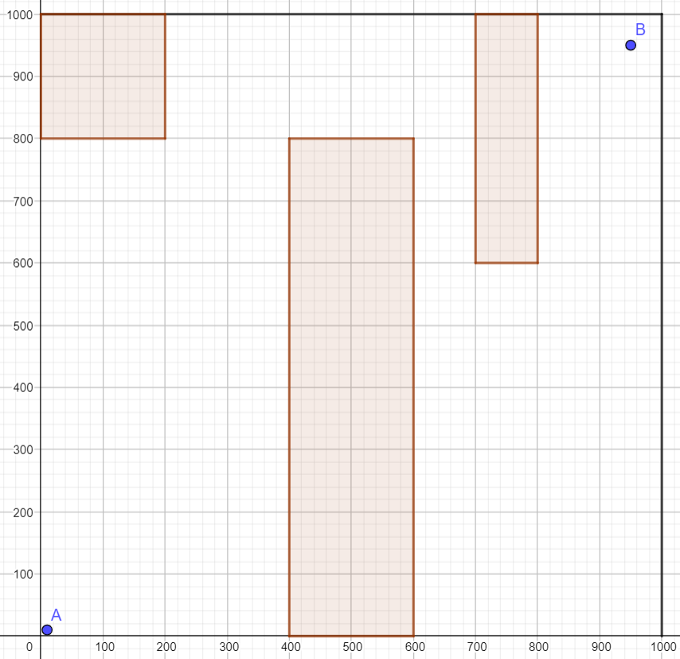
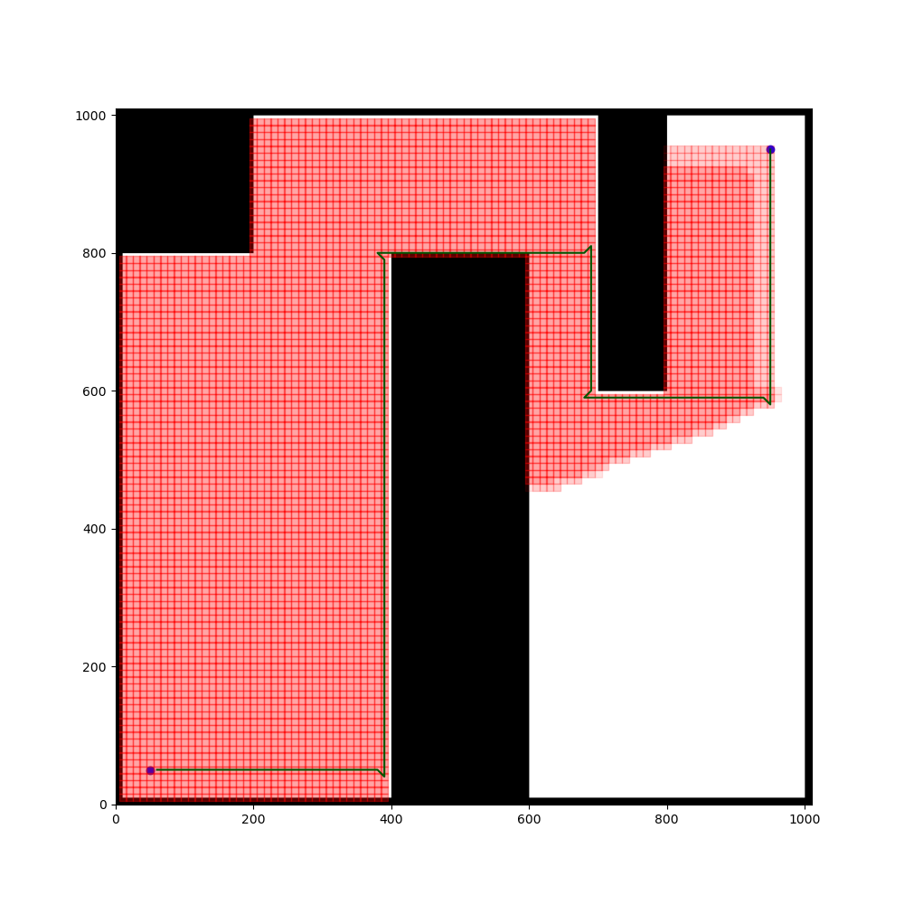

# A-Star-With-Orientation
Some values are hardcoded because i was too lazy to fix them
## Credit
https://github.com/AtsushiSakai/PythonRobotics
thier code helped alot.
## Robot
On a grid starting from (0,0) to (1000,1000) a robot that is represented as a single point is placed at (50,50) with angle 0 degrees and is trying to reach (950,950) with angle 90 degrees

The robot is unable to move except in steps of 10.
### This means that the robot has 3 discrete motions
.PNG):

    10 steps to the front (From point A to point C)
    a 10 step left turn to the front (From point A to point E)
    a 10 step right turn to the front (From point A to point G)

### Assuming there are obstacles as below
 

### I used A* to solve the plan the path

